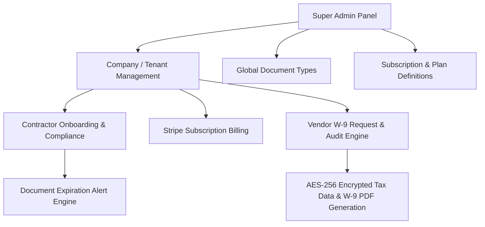

# Project Overview & SaaS Architectural Review: Smart Support

> **Reviewed by**: Senior PHP & Laravel SaaS Solutions Architect  
> **Target Project**: Smart Support (Contractor Compliance & Vendor Management Platform)  
> **Date**: August 2026  

---

## 1. Executive Summary

**Smart Support** is an enterprise-grade, multi-tenant B2B SaaS platform built using PHP and the Laravel framework. The application provides end-to-end management for **Contractor Compliance**, **Automated Document Expiration Tracking**, and **Vendor W-9 Tax Compliance**.

The application is structured into four primary user tiers:
1. **Super Admin**: Global administrative control, subscription plan management, document type definition, system settings, audit logs, and tenant impersonation.
2. **Company (Tenant)**: Organization accounts managing contractor lists, tracking compliance scores, managing subscription billing (Stripe), and sending/auditing W-9 requests.
3. **Contractor (End User)**: Workers/contractors who upload compliance documents (licenses, certificates, insurance), view compliance status, and manage security settings.
4. **Vendor**: Third-party entities completing secure, multi-step W-9 forms with electronic signatures and encrypted data storage.

---

## 2. Core Functional Modules



### A. Tenant Subscription & Monetization (Stripe Integration)
- **Billing Models**: Supports tiered plan structures (monthly/annual contractor limits) and pay-as-you-go add-on seats ($15 per extra contractor).
- **Stripe Integration**: Utilizes `\Stripe\StripeClient` for Checkout Sessions, Customer Creation, and Subscription Management.
- **Automated Webhooks**: Implements `handleStripeWebhook` to handle subscription lifecycle events (`customer.subscription.deleted`, `customer.subscription.updated`).
- **Feature Gating**: Enforces contractor limits and custom document access based on the company's active subscription status.

### B. Contractor Compliance Engine
- **Document Matrix**: Dynamic document requirements based on company configuration.
- **Compliance Score Calculation**: Real-time compliance percentage tracking per contractor and aggregated company-wide metrics.
- **Expiration Tracking**: Background/cron monitoring (`checkExpired()`) with automated email reminder queues (`EmailQueue`) for expiring or missing documents.
- **Approval Workflow**: Company admins review, approve, or reject contractor documents with rejection reasons and version history tracking.

### C. Secure Vendor W-9 & Tax ID Collection
- **Multi-Step Submission Engine**: Tokenized 4-step W-9 form flow allowing external vendors to securely submit tax information without requiring a full platform account.
- **Field-Level Data Encryption**: Sensitive fields (`tax_id_number`, `entity_name`, `address`, `signature`) are encrypted using **AES-256-CBC** via `FileEncryptionService`.
- **FPDI & Ghostscript PDF Generation**: Dynamically maps vendor responses onto the official IRS Form W-9 PDF using `setasign/Fpdi` and flattens outputs via `Ghostscript`.
- **Audit & Anti-Fraud Trail**: Page 2 of the generated PDF contains an immutable audit log detailing IP address, browser User-Agent, device type, bot verification status, and timestamped signature verification.

### D. Security & Access Control
- **Multi-Guard Middleware**: Custom route middleware (`AdminAuth`, `CompanyAuth`, `UserAuth`) enforcing strict role isolation.
- **Two-Factor Authentication (2FA)**: OTP-based 2FA support for account logins.
- **Session & Device Audit**: Tracks active logins, IP addresses, and User-Agents (`Device`, `Log` models), providing forced session revocation (`revokeAll`).
- **Support Impersonation**: Administrative helper routes (`login-as-company`, `login-as-contractor`, `login-back`) for seamless customer support.

---

## 3. Architecture & Codebase Inspection

| Area | Implementation Details | Rating / Assessment |
| :--- | :--- | :--- |
| **Framework** | Laravel MVC architecture, Blade templating system | **Good** — Standard Laravel conventions followed for routing and middleware. |
| **Database Scoping** | `company_id` foreign key isolation across user, document, and vendor tables | **Satisfactory** — Manual scoping used; scope helper utility present in `DocumentHelper`. |
| **Data Encryption** | OpenSSL `aes-256-cbc` field encryption & encrypted signature image storage | **Strong** — Protects PII and sensitive US tax information (SSN/EIN). |
| **PDF Engineering** | `setasign/Fpdi` coordinate writing + Ghostscript shell flattening | **Advanced** — Solves complex IRS PDF form filling and visual signature embedding. |
| **Task Scheduling** | `CronController` + Artisan `schedule:run` entry point route | **Functional** — Simple web-triggered scheduler setup. |

---

## 4. Key Strengths

1. **Complete SaaS Business Lifecycle**: Fully covers onboarding, tier management, Stripe payments, extra seat purchasing, and automated plan expiration handling.
2. **High Security Standards for Sensitive Data**: Excellent use of AES-256 encryption for W-9 tax data and encrypted signature storage in public directories.
3. **Comprehensive Audit Engine**: Detailed digital footprint tracking (IP, OS, browser, timestamps) built directly into compliance PDF documents.
4. **Flexible Multi-Role Interface**: Well-separated views and controllers tailored specifically for Admins, Companies, Contractors, and external Vendors.

---

## 5. Architectural Recommendations & SaaS Refactoring Opportunities

To bring the codebase to peak enterprise SaaS standards, the following improvements are recommended:

### 1. Extract Domain Services from Controllers (Clean Architecture)
* **Current State**: Controllers such as `VendorController` and `SubscriptionController` contain heavy inline procedural code (Stripe API calls, OpenSSL operations, Ghostscript PDF rendering, coordinate positioning).
* **Recommendation**: Refactor business logic into dedicated Service classes under `App\Services`:
  - `App\Services\StripeSubscriptionService`: Handle customer creation, checkout sessions, and webhook processing.
  - `App\Services\W9PdfGeneratorService`: Handle FPDI coordinate placement, Ghostscript execution, and signature decryption.
  - `App\Services\ComplianceCalculationService`: Handle document compliance calculations.

### 2. Replace Direct `env()` Access with `config()`
* **Current State**: `SubscriptionController.php` calls `env('STRIPE_WEBHOOK_SECRET_KEY')` directly inside controller methods.
* **Recommendation**: Map all environment variables inside `config/setting.php` or `config/services.php` and use `config('setting.stripe_webhook_secret_key')`. Calling `env()` directly returns `null` when configuration is cached via `php artisan config:cache`.

### 3. Enforce Global Tenant Scopes
* **Current State**: Multi-tenant isolation relies on manual `where('company_id', $authId)` additions in controller and model queries.
* **Recommendation**: Implement a Laravel Global Scope or custom trait (e.g. `BelongsToTenant`) that automatically applies `where('company_id', auth()->user()->company_id)` for non-admin users to eliminate risk of cross-tenant data exposure.

### 4. Asynchronous Queue Processing
* **Current State**: Email notifications (`General::sendEmail`) and PDF operations execute synchronously within the HTTP request cycle.
* **Recommendation**: Implement Laravel Queues (`ShouldQueue`) backed by Redis or database queue driver to speed up response times for end users.

### 5. Transition Shell Execution to Laravel Process API
* **Current State**: Ghostscript shell execution uses raw `exec($cmd)` in `VendorController.php`.
* **Recommendation**: Upgrade to Laravel's `Illuminate\Support\Facades\Process` for safer execution, error logging, and timeout prevention:
  ```php
  use Illuminate\Support\Facades\Process;

  $result = Process::run("gs -sDEVICE=pdfwrite -dCompatibilityLevel=1.4 -dBATCH -sOutputFile={$convertedPdf} {$originalPdf}");
  if ($result->failed()) {
      Log::error('Ghostscript PDF conversion failed: ' . $result->errorOutput());
  }
  ```

---

## 6. Summary Directory Structure Reference

```
Smart Support Project Root
├── app/
│   ├── Http/
│   │   ├── Controllers/
│   │   │   ├── AccountController.php
│   │   │   ├── AuthController.php
│   │   │   ├── CronController.php
│   │   │   ├── DocumentController.php
│   │   │   ├── FrontController.php
│   │   │   ├── Admin/          (Super Admin logic: Companies, Users, System Logs, SEO, Settings)
│   │   │   └── Company/        (Tenant logic: Contractor management, Billing, Vendors, Reports)
│   │   └── Middleware/         (AdminAuth, CompanyAuth, UserAuth, VerifyCsrfToken)   
├── resources/
│   └── views/                  (Blade views: Admin, Company, Contractor, Email templates, Vendor W-9 forms)
├── routes/
│   ├── api.php                 (Stripe Webhook endpoint)
│   ├── console.php             (Console commands)
│   └── web.php                 (Main routing matrix & role groupings)
└── overview.md                 (Architectural Review & SaaS Roadmap)
```
